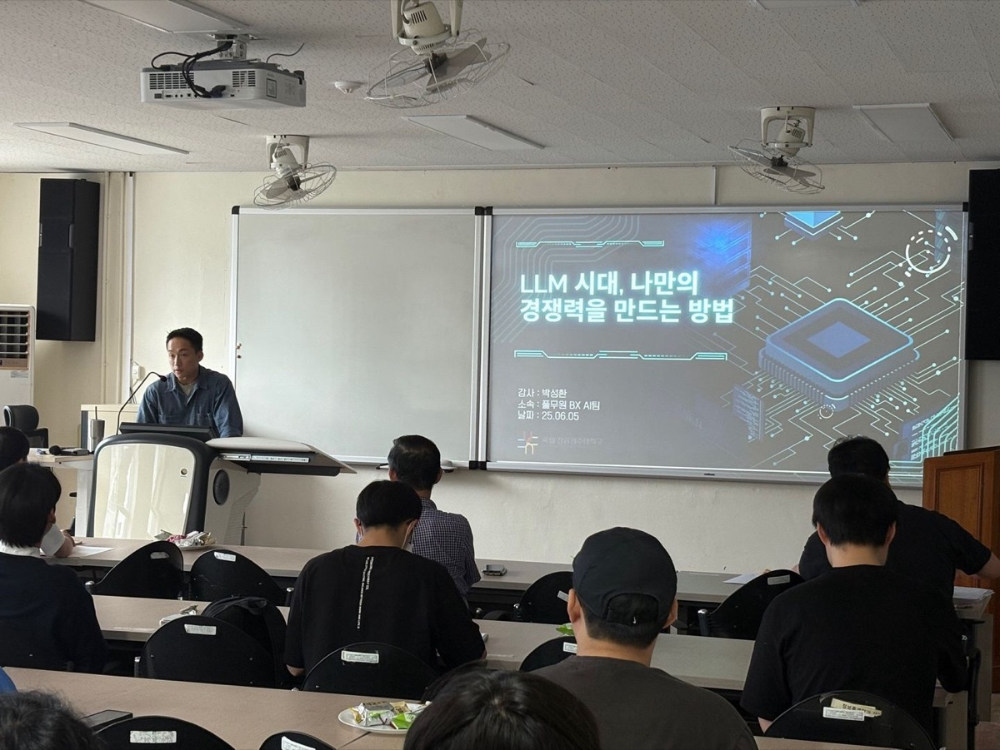

# SeongHwan Park

**AI Agent Engineer / LLM Application Developer**

---

## 👋🏻 About Me

| Field | Experience |
|---|---|
| 🤖 NLP · Chatbot | **5 yrs 9 mos** |
| ☕ Java · Oracle | **3 yrs 7 mos** |
| 📊 Data Analysis | **1 yr 8 mos** |

I build LLM applications end to end — from deep-learning NLP modeling to planning, developing and deploying RAG and multi-agent chatbots.

- **Engineering is not a solo sport.** — *"If you can't teach it, you don't know it."* 
  I've led DL model planning and AWS pipeline builds together with planners, infra, back-end and non-technical partners.
- **Business growth is my growth.** 
  Better modeling means better services for users — that's where I grow.
- **I modularize everything.** 
  I packaged my most-used functions and published them to PyPI → [`pshmodule`](https://github.com/hipster4020/pshmodule)

---

## 🛠 Tech Stack

**Core** 

**Vector · Graph · Data** 

**Deep Learning** 

**Infra · Tools** 

---

## 💼 Career

### 🥬 Pulmuone — BX AI Team / AI Agent Engineer
`2023.09 ~ Present`

**HR AI Assistant Chatbot — RAG** *(Lead Developer)*
- Built an HR Q&A chatbot: GPT-based classification routes each question to a primary category, then an open-source model answers via RAG.
- Owned product planning end to end — document upload page, chat UI and DB design.

**Multi-Agent Chatbots — Modular RAG on LangGraph** *(Lead Developer & Planner)*
- **Sales Assistant** — Text2SQL pipeline generating queries from metadata, glossary and question–query examples; led planning of the admin page, chat UI, DB and model API deployment.
- **Indirect Procurement Contract Agent** — Scenario branching (classification → RAG → answer) with nodes for contract-category recommendation, purchase requests and POs; served via FastAPI in production.
- Also shipped legal/regulatory and factory-tour bots, plus a reusable chatbot UI template integrated with n8n workflows.

**AICC Voice Bot — Assistant API** *(Lead Developer)*
- Intent classification mapped to resolution actions; completed the full call-center flow (call → operation → STT → LLM → TTS).

### 📝 TEXTNET — TF Team / Modeler
`2022.11 ~ 2023.09`

- **Ad Copy Generation Reflecting Selling Points** — Extracted selling points via ChatGPT prompt tuning, converted writing style with T5, and fine-tuned Koalpaca-Polyglot (PEFT LoRA, instruction format) to generate ad copy matched to a selling point and MBTI type.
- **Personalized Ad Message Generation by Personality Type** — Collaborated with a major domestic retail group to re-implement a model that tailors ad messages to each personality type's style.
- **Meme Bot** — SBERT cosine-similarity retrieval with an LLM fallback; data augmentation via Korean eojeol/final-consonant EDA and pretrained-model style transfer.

### 📈 Illunex — AI Team / Senior Engineer
`2021.02 ~ 2022.11`

- **Category Classification** — Article classifier on Transformer encoder outputs, with an AWS pipeline writing predictions into MariaDB.
- **Sentiment Analysis with Active Learning** — Applied Learning Loss for Active Learning to a KoELECTRA positive/negative/neutral classifier, cutting manual annotation effort.
- **Named Entity Recognition** — BERT-based NER on the KLUE NER dataset to extract company names from article bodies.
- **Keyword Extraction & News Crawling** — KeyBERT keyword pipeline plus a Dockerized Selenium XPath crawler for news and startup sites.

### 📚 FutureNuri — Dev1 Team / Assistant Manager
`2017.06 ~ 2021.01`

- Data analysis and migration for a library automation solution used by public and university libraries.
- Owned the acquisitions, serials and reserved-books modules (back-end & front-end) and Oracle DB data migration.

---

## 📄 Paper

**When Can You Trust an Agent's Own Verifier?** — Stress-Testing Counterfactual Rationale Verification Under Search Pressure and Oracle Access 
`NeurIPS 2026 Workshop (non-archival)`

> Proposed a stress-testing protocol for label-free agent verifiers under optimization pressure — a pressure ratio ρ quantifying how strongly a verifier steers agent search, plus falsifiable probes for distinct failure modes (no signal, weak influence, claim-minimization, pre-commit query access). Evaluated the Rationale Consistency Score (RCS) in an LLM agent designing ML pipelines, with a capability-control experiment separating agent capability from search failure.

---

## 📘 Book

<table>
<tr>
<td width="200"></td>
<td>

**Hugging Face Transformers Hard Training for Natural Language Processing** 
🏅 **Sejong Book Award 2025 — Selected Title** 
BJPublic

A hands-on guide to Hugging Face for NLP, built around practice code and its results so readers understand language models and transformers through the library's own features.

[📖 Kyobo Book](https://product.kyobobook.co.kr)

</td>
</tr>
</table>

---

## 🎤 Special Lectures

- **Gangneung-Wonju National University**, Dept. of Data Science — special lecture on AI & data analysis, *"How to Build Your Own Competitive Edge in the LLM Era"*
- **Namseoul University**, Dept. of Distribution & Marketing — special lecture on AI & data analysis

---

## 🎓 Education

- **M.Eng. in Artificial Intelligence (in progress)** — Yonsei University, Graduate School of Engineering · `2026.02 ~`
- **B.S. in Information & Statistics** — Gangneung-Wonju National University · `2008.03 ~ 2015.02`

## 📜 Certificates

- `2019.04` SQLD — Korea Data Agency
- `2017.05` Engineer Information Processing — HRD Korea
- `2014.08` Social Survey Analyst Level 2 — HRD Korea

---

## 🗂 Featured Repositories

| Repository | Description |
|---|---|
| [pshmodule](https://github.com/hipster4020/pshmodule) | Utility package for preprocessing, file I/O and crawling (PyPI) |
| [sentiment_classification](https://github.com/hipster4020/sentiment_classification) | KoELECTRA sentiment classification with active learning |
| [encoder_classifier_with_pl](https://github.com/hipster4020/encoder_classifier_with_pl) | Transformer encoder classifier with PyTorch Lightning |
| [category_classification](https://github.com/hipster4020/category_classification) | Article category classification |
| [keybert](https://github.com/hipster4020/keybert) | Keyword extraction with KeyBERT |

 

